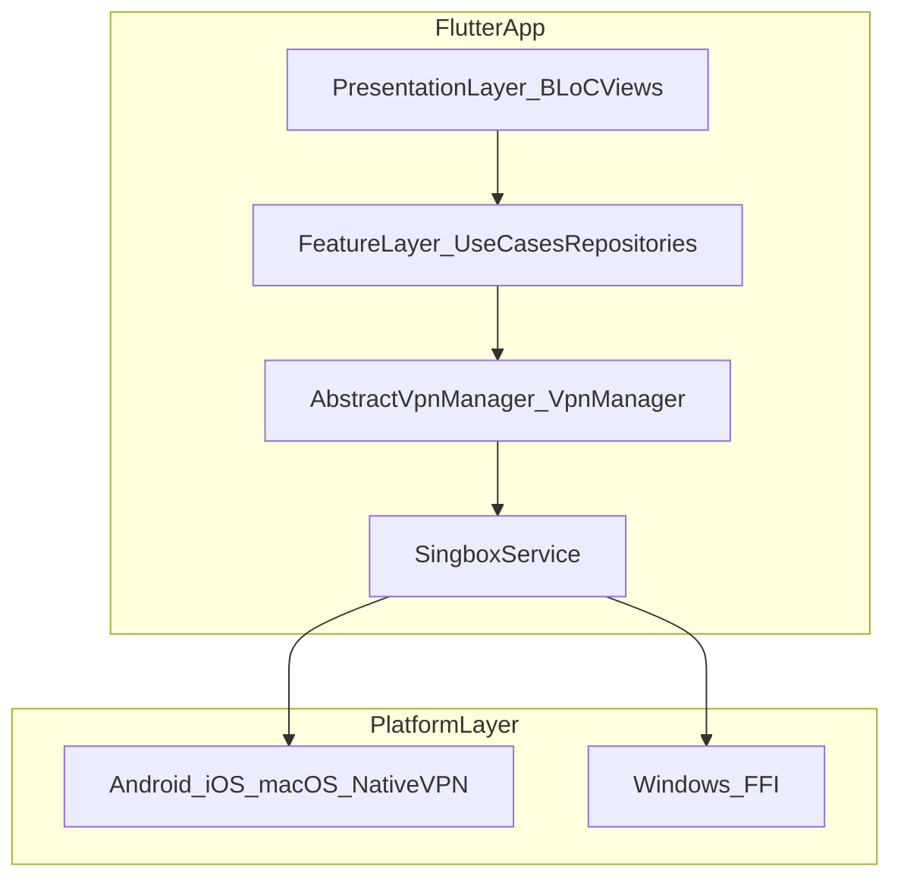

# Zenshield VPN Product Requirements Document

## Purpose and scope

Zenshield is a multi-platform VPN client built in Flutter that helps users
authenticate, connect to secure VPN routes, and switch servers and protocols.
This document describes the current product architecture and explains why
each major component exists.

## Product summary

- Product: `zenshield` (`"Free VPN"` in `pubspec.yaml`).
- Platforms: Android, iOS, macOS, and Windows.
- Scope: authentication and VPN connectivity only — no bandwidth-sharing,
  rating prompts, or in-app update checks.
- Core model: Flutter UI and feature logic orchestrate VPN lifecycle through
  a unified manager, while platform-specific native services and/or FFI
  execute tunnel operations.

## High-level architecture

### Runtime flow at a glance

1. UI modules dispatch events through BLoCs.
2. Domain features coordinate operations (config/auth/server selection).
3. `VpnManager` owns connection lifecycle (enable/disable/status/timer).
4. `SingboxService` picks transport path:
   - Platform channels for Android/iOS/macOS.
   - FFI for Windows.
5. Native tunnel runtime reports state/statistics back via command sockets
   and event channels.

## Component catalog (what and why)

### 1) App entry and bootstrap

- [`lib/main.dart`](../lib/main.dart)
  Why it exists:
  - Initializes dependency injection before app startup.
  - Configures optional crash reporting and analytics (Firebase Crashlytics,
    ambilytics — both no-ops if unconfigured, see `README.md`).
  - Handles desktop-specific window/launch-on-startup behavior.
  - Acts as the single bootstrap boundary so platform and feature services
    come up in a predictable order.

### 2) Presentation layer (UI + state machines)

- [`lib/feature/*/presentation`](../lib/feature)
  Why it exists:
  - Encapsulates user-facing flows as per-feature slices (`home`, `servers`,
    `protocols`, `settings`, `auth`, `reset_password`, `logs`, etc.).
  - Uses BLoC and side effects to keep UI deterministic and testable.
  - Keeps screen-specific logic separate from infrastructure concerns.

- [`lib/core/route/app_router.dart`](../lib/core/route/app_router.dart)
  Why it exists:
  - Provides a single route generation point.
  - Applies platform-appropriate navigation behavior (Cupertino routes on
    iOS, fade transitions elsewhere).

### 3) Feature and domain layer

- [`lib/feature`](../lib/feature)
  Why it exists:
  - Organizes business capabilities by domain instead of UI location. Each
    feature is a self-contained `data/domain/presentation` slice.
  - Core domains include:
    - VPN lifecycle: `vpn_connection`, `singbox`, `vpn_config`, `connection`.
    - Network selection: `servers`, `region_checker`, `network_monitor`.
    - Account and access: `auth`, `user_info`, `deep_links`.
    - Supporting: `launch` (launch-on-startup), `logs`, `about`, `settings`.

- [`lib/feature/vpn_connection`](../lib/feature/vpn_connection)
  Why it exists:
  - Serves as the main VPN lifecycle coordinator (`VpnManager`).
  - Starts/stops VPN, subscribes to status/stats streams, and manages timer
    behavior.
  - Publishes connection-state changes to the app event bus so UI and
    features react consistently.

- [`lib/feature/singbox/data/singbox_service.dart`](../lib/feature/singbox/data/singbox_service.dart)
  Why it exists:
  - Defines the abstraction for VPN tunnel runtime integration.
  - Hides platform differences behind a common interface (`init`, `start`,
    `stop`, status streams, diagnostics).

- [`lib/feature/singbox/data/platform_singbox_service.dart`](../lib/feature/singbox/data/platform_singbox_service.dart)
  Why it exists:
  - Implements the native-channel path for Android/iOS/macOS.
  - Bridges Flutter to native VPN services using method and event channels.

- [`lib/feature/singbox/data/ffi_singbox_service.dart`](../lib/feature/singbox/data/ffi_singbox_service.dart)
  Why it exists:
  - Implements the Windows path where direct FFI control is used, talking
    to `singbox-tunnel.exe` (a separate Windows Service — see
    `windows/packaging/build_native.sh`).
  - Starts/stops tunnel core and wires command clients to status/stat
    streams.

- [`lib/feature/singbox/data/command_client`](../lib/feature/singbox/data/command_client)
  Why it exists:
  - Standardizes communication with command sockets for telemetry and
    control.
  - Isolates socket protocol details from higher-level feature code.

### 4) Cross-cutting infrastructure

- [`lib/core`](../lib/core)
  Why it exists:
  - Hosts shared infrastructure: constants, interceptors, preferences,
    secure-storage keys, managers, and utility mapping logic.
  - Prevents feature modules from reimplementing common mechanics.

- [`lib/di/injection_container.dart`](../lib/di/injection_container.dart)
  Why it exists:
  - Centralizes all service wiring (`get_it` + `injectable`).
  - Resolves platform-specific implementations (Singbox service, launch
    manager) in one place.
  - Improves startup determinism and testability by making dependencies
    explicit.

### 5) Native platform components

- [`android/app/src/main/kotlin/com/zenshield/vpn/bg`](../android/app/src/main/kotlin/com/zenshield/vpn/bg)
  Why it exists:
  - Implements Android tunnel runtime (`VPNService`, `BoxService`),
    foreground behavior, notifications, and network monitoring.
  - Owns lower-level Android lifecycle and system integration required by
    the OS.

- [`android/app/src/main/kotlin/com/zenshield/vpn/handlers/MethodHandler.kt`](../android/app/src/main/kotlin/com/zenshield/vpn/handlers/MethodHandler.kt)
  Why it exists:
  - Bridges Flutter method calls to Android native actions.
  - Keeps channel contract logic separate from service runtime code.

- `ios/Runner/VPN/VPNManager.swift`
  Why it exists:
  - Uses `NETunnelProviderManager` to configure and start/stop Apple VPN
    tunnels.
  - Encapsulates NetworkExtension setup and preference management for
    iOS/macOS flows.

### 6) Observability (optional)

- Firebase Crashlytics and `ambilytics` are initialized in app bootstrap if
  configured. Both are no-ops without a real Firebase project — see
  `README.md` for setup. Talker provides local runtime logging regardless.

## Key user flows (high-level)

### Connect to VPN

1. User taps connect in UI module.
2. BLoC dispatches action to VPN domain.
3. `VpnManager.enableVpn` loads config and starts `SingboxService`.
4. Native/FFI tunnel starts.
5. Status events map to app connection states and update UI + timers.

### Switch server

1. User selects server/protocol.
2. Domain updates config and may preserve timer during transition.
3. Tunnel restarts through Singbox abstraction.
4. Event bus publishes switched/connected state to UI modules.

### Authentication and account recovery

1. Auth modules call auth features/repositories.
2. Tokens/session data are persisted with secure storage/preferences.
3. Password recovery and inbox verification modules complete account
   recovery loop.

## External dependencies and integrations

- Backend APIs accessed through `Dio` and auth interceptors.
- Native OS VPN APIs:
  - Android VPN services.
  - Apple NetworkExtension (`NETunnelProviderManager`).
- Optional analytics/telemetry: Firebase Crashlytics, `ambilytics`, Talker
  (local logging).
- Localized strings generated under `lib/l10n`.

## Out of scope and assumptions

- This PRD documents current architecture and component rationale.
- It does not redefine product roadmap, legal policy text, or marketing
  positioning.
- Detailed low-level protocol internals are intentionally abstracted unless
  needed for architecture clarity.
